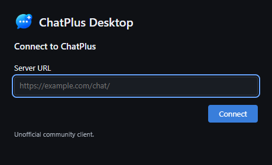
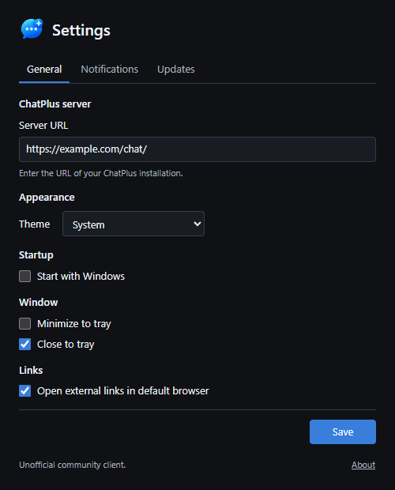
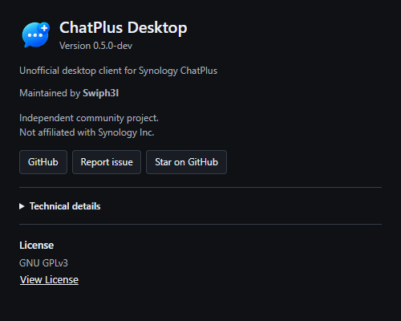

# ChatPlus Desktop

> Unofficial community desktop client for Synology ChatPlus.


ChatPlus Desktop provides a lightweight desktop experience for users of
self-hosted Synology ChatPlus installations. It adds tray support,
Light/Dark/System themes, native menus and desktop window handling while using
your own server.

> [!IMPORTANT]
> **Unofficial project**
>
> ChatPlus Desktop is an independent community project.
> It is not developed by, affiliated with, endorsed by, sponsored by,
> maintained by, or supported by Synology Inc.

Maintained by **Swiph3l**.
[GitHub](https://github.com/Swiph3l/synology-chatplus-desktop) ·
[Report an issue](https://github.com/Swiph3l/synology-chatplus-desktop/issues)

## Project status

Early development: **0.5.0-dev**. No public release is available yet.
Windows is the primary tested platform; Linux and macOS require additional testing.

The repository remains `synology-chatplus-desktop` for discoverability.
The application name is **ChatPlus Desktop**.

## Features

- Dedicated desktop window with a configurable ChatPlus server
- Light, Dark and System themes
- System tray, start with Windows and close/minimize-to-tray preferences
- Native menus with reload, zoom and fullscreen controls
- Window position and size persistence
- Browser-managed ChatPlus session persistence
- WebView file uploads, downloads and clipboard support
- Same-origin navigation and optional external links in the default browser
- About window with build information and safe diagnostics

Planned:

- Reliable desktop notification integration
- Unread-message indicators
- Signed updates

Synology Meet camera/microphone behavior still needs validation. Permissions are
not granted automatically. File dialogs, clipboard and session behavior also
depend on the installed ChatPlus and system WebView versions.

## Screenshots







UI previews use an example configuration and contain no private server addresses
or account data.

## Supported platforms

| Platform                    | Status                                          |
| --------------------------- | ----------------------------------------------- |
| Windows x64                 | Public Beta target; Microsoft WebView2 required |
| Linux x64                   | Experimental; runtime validation pending        |
| macOS Intel / Apple Silicon | Experimental; runtime validation pending        |
| Windows ARM64               | Not validated                                   |

The app uses the system WebView and does not bundle Chromium.

## Installation

Build locally using the instructions below. Windows builds produce an unsigned
NSIS installer in `src-tauri/target/release/bundle/nsis/`. Windows may warn about
the unsigned binary. The installer can download the WebView2 bootstrapper if the
runtime is missing.

Installation presents the GPLv3 license and bundles a separate independent-project notice.
See [INSTALLER_LICENSE.txt](INSTALLER_LICENSE.txt).

## Configuration

Enter your server URL and select **Connect**. Setup closes and ChatPlus opens
immediately; sign in through your server's own interface. Later launches load
the configured server directly.

Open **Settings** from File or the tray menu to change the server, theme, startup,
window and external-link preferences. **Save** applies the settings and closes
the dialog. Invalid addresses leave it open with an error.

Use an HTTP(S) URL such as `https://example.com/chat/`, without embedded
credentials, query parameters or fragments. HTTPS is recommended. Launch with
`--settings` to open preferences directly. **Quit** exits even when close-to-tray
is enabled.

ChatPlus Desktop does not replace or redistribute Synology ChatPlus. It connects
to an installation already hosted by you:

```text
ChatPlus Desktop → Tauri / system WebView → Your Synology ChatPlus server
```

No Synology server software or application files are included.

## Themes

**Light** preserves the server's appearance. **Dark** adds independently authored
EOS variables and targeted component overrides. **System** follows the OS theme.
A document-start stylesheet and matching window background reduce white flashes.

Server and theme changes reopen the ChatPlus view; finish drafts and calls first.
Visual coverage depends on the ChatPlus version. Some dialogs, threads, search
and mention interfaces still need testing.

## Notifications

Settings > Notifications includes **Send test notification**, privacy modes and
sound controls. A Windows WebView2 browser-notification bridge is implemented;
real-message delivery still requires validation with the installed ChatPlus version.
On Windows, sidebar unread indicators drive a boolean title/tray dot; an exact
total is unavailable. Real-message/read transitions still need end-to-end testing.
Permissions are requested only through an explicit Notifications action.
See [notification behavior and safe testing](docs/NOTIFICATIONS.md).

## Building from source

Install Node.js 22 or later, npm and stable Rust. Windows builds need Visual
Studio C++ Build Tools, the Windows SDK and WebView2. See
[Tauri prerequisites](https://v2.tauri.app/start/prerequisites/) for platform dependencies.

```sh
npm ci
npm run tauri build
```

The build also bundles the document-start theme script. For Linux use
`npm run tauri build -- --bundles deb`; for macOS use
`npm run tauri build -- --bundles app,dmg`.

## Development

```sh
npm ci
npm run tauri dev
```

Run from the repository root. `npm run dev` alone serves the local UI; saving
preferences requires the desktop host.

Checks:

```sh
npm run format:check
npm run typecheck
npm test
npm run build
npm run check:release
cargo fmt --manifest-path src-tauri/Cargo.toml -- --check
cargo check --locked --manifest-path src-tauri/Cargo.toml
cargo test --locked --manifest-path src-tauri/Cargo.toml
cargo test --release --locked --manifest-path src-tauri/Cargo.toml
```

Debug builds include a synthetic local fixture and Developer menu; both are
excluded from release builds. CI checks platform builds without publishing
installers. Reviewed version tags trigger a Windows-only draft release; publication is manual.

About shows the version and maintainer. **Technical details** contains build,
Git and runtime information plus **Copy Diagnostics**. Unknown values appear as
Unavailable. Untagged builds display `0.5.0-beta.1-dev+<commit>`; source/package versions
remain `0.5.0-beta.1`. Builds do not create tags or change versions.

Settings includes update channels, opt-in automatic checks and manual checking.
The signed updater is implemented but disabled until a production verification key
and release are configured. Unconfigured checks make no network request. See
[updater configuration and tests](docs/UPDATER_SIGNING.md).

## Security & verification

Windows: **Unsigned / SmartScreen warning possible**. An unsigned beta does not establish
publisher identity; do not disable SmartScreen to install it.

Release verification tooling produces `SHA256SUMS.txt` from final packages and
separate npm/Rust CycloneDX SBOMs. These describe dependencies, including build
tools; they do not certify safety. The public GitHub draft-release workflow generates
artifact attestations. Local builds are not attested. See the
[Windows beta process](docs/WINDOWS_BETA.md) for signing prerequisites and smoke tests.
Verify a future attested artifact with:

```sh
gh attestation verify <artifact> -R Swiph3l/synology-chatplus-desktop
```

Compare a downloaded file with the published checksum using `Get-FileHash`
(PowerShell), `sha256sum` (Linux), or `shasum -a 256` (macOS). A checksum alone
does not authenticate its publisher.

Dependency audits use `npm audit`, `cargo audit` and `cargo deny`; weekly
Dependabot configuration covers npm, Cargo and Actions. CodeQL configuration
covers TypeScript/JavaScript, Rust and Actions for this public GPLv3 project.
Configuration is not evidence of a successful GitHub scan.
See [SECURITY.md](SECURITY.md) for security boundaries and known limitations, and
the [release checklist](docs/RELEASE_CHECKLIST.md) for verification procedures.

Authentication remains with your server. TLS checks stay enabled, and remote
content receives no native IPC permissions. Diagnostics omit server URLs,
account data and messages. Copying diagnostics replaces the clipboard contents.
See [SECURITY.md](SECURITY.md) for details and reporting guidance.

Preferences and WebView-managed site data persist in the OS app profile.
Changing servers does not erase old site data; sign out before sharing access
to your computer.

Only the independent desktop shell, its dependencies and project-authored theme
overrides are packaged. No Synology JavaScript/CSS bundles, official logos or
application icons are redistributed.

Same-origin popups are routed into the main window. Separate Meet popups and
cross-origin SSO are not supported yet. Connection status describes document
transport, not authentication or server health; platforms other than Windows
currently report connecting/unknown.

## Contributing

See [CONTRIBUTING.md](CONTRIBUTING.md). Contributors retain their copyright and
contribute under the project's GPL-3.0-only license.

You can [report bugs](https://github.com/Swiph3l/synology-chatplus-desktop/issues),
suggest improvements, contribute fixes or
[star the repository](https://github.com/Swiph3l/synology-chatplus-desktop).

## License

ChatPlus Desktop is open-source software licensed under the
GNU General Public License v3.0 (GPL-3.0-only).

You may use, study, modify and redistribute the software, including commercially,
under the terms of GPLv3. If you distribute a modified version covered by the GPL,
its corresponding source must remain available under GPLv3.

See [LICENSE](LICENSE) for the complete terms and [NOTICE](NOTICE) for attribution.
Third-party dependencies retain their own licenses and copyrights.
See [licensing and dependency review](docs/LICENSING.md).

## Trademark notice

Synology, Synology ChatPlus, DSM, and related product names and trademarks
are the property of Synology Inc. and their respective owners.

ChatPlus Desktop is an independent community project and is not affiliated
with or endorsed by Synology Inc.

Product names are used only to describe compatibility and interoperability.
